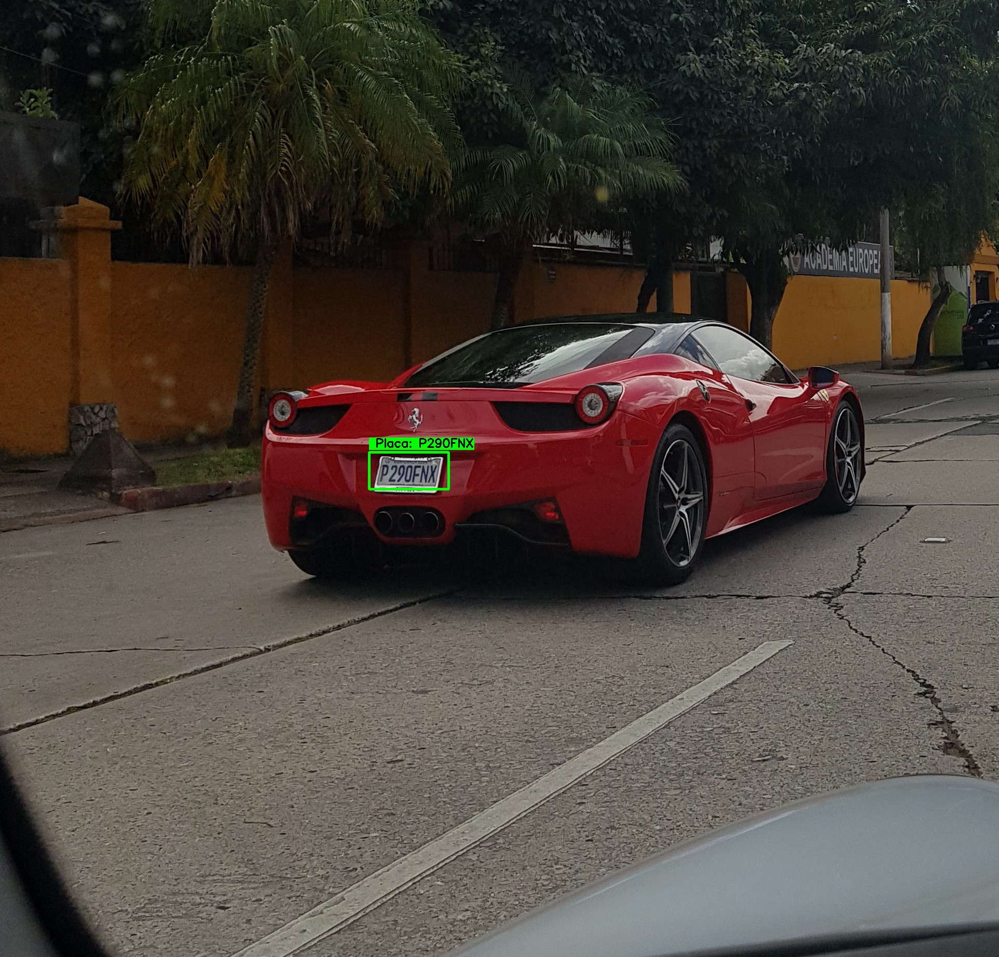

# Reconocimiento de placas | Geordie Quiroa
---

La descripción técnica, matemática y práctica, así como el detalle del procedimiento que permitió alcanzar el resultado de predicción en la imagen anterior se encuentra en el jupyter notebook.

# Observaciones
---
* Descargar pesos y configuración de la red neuronal convolucional de YOLO para detectar el objeto placa [aquí](https://www.kaggle.com/achrafkhazri/yolo-weights-for-licence-plate-detector).
  * lapi.weights
  * darknet-yolov3.config
  * NO descargar classes.names
* En el notebook, al querer correr una imagen, cambiar el path de la imagen a testImages. Ej: './testImages/auto.jpg' en lugar de './auto.jpg'
* Para crear el dataset con la tipografía de Guatemala; utilizada para el entrenamiento de la NN, crear un directorio dataset, con subdirectorios de la A-Z y 0-9, para almacenar las imágenes creadas y aumentadas.

## Requerimientos
---
* Python 3.7
### Dependendencias
* requirements.txt
